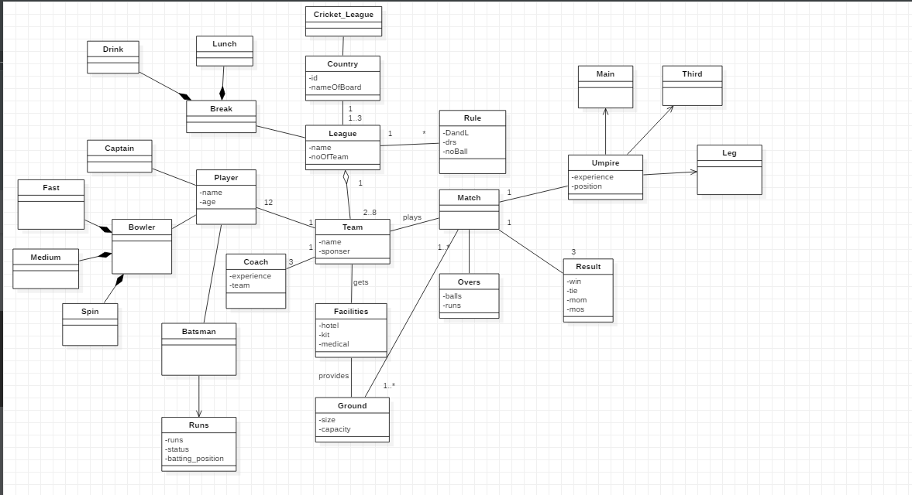

##Cricket Domain

A Cricket league is a league which includes matches between teams which participate in the league.

The cricket league is held and concluded all over the world either between two countries or within country itself

The league is controlled and set up with the predefined cricketing rules.

Basically the teams are devided into two groups and initially group matches are held. the top two teams of each group qualify for the Semis.

###The team includes: 
  1.players 
  2.Coaching
  
  